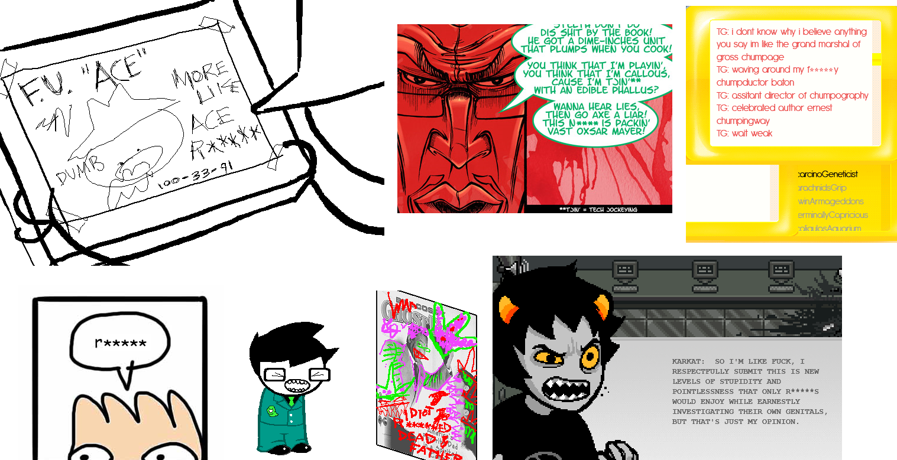

# Homestuck Slur Removal Mod

This is an [Unofficial Homestuck Collection](https://unofficial-homestuck-collection.carrd.co/) [mod](https://github.com/GiovanH/unofficial-homestuck-collection/wiki/Third-Party-Mods) that censors slurs in Homestuck and other Hussie works. Nothing more, nothing less. 

Other replacement projects have added some frankly cringeworthy original writing and taken liberties with what exactly counts as a slur (including dialogue mentioning Bill Cosby, and, somehow, the vile epithet "white rapper"). And after that, they still missed some real ones!

This attempt is updated, exhaustive, and as unopinionated as I could make it. It replaces r-words, n-words and homophobic f-words with asterisked versions, as the multimedia sample above and the simple code in mod.js perfectly illustrate.

## Usage

Extract this as its own folder inside the `mods/` directory of the Homestuck Collection Asset Pack. The path `[...]/mods/homestuck-slur-removal-mod/mod.js` should be valid.